# Wireshark
## Wireshark. IP 
```
feggie@feggie-NBLK-WAX9X:~$ traceroute -m 15 akamai.com 56
traceroute to akamai.com (104.102.4.229), 15 hops max, 56 byte packets
 1  _gateway (192.168.0.1)  4.223 ms  4.185 ms  4.157 ms
 2  vlan591.schevchenko.bb.pu.ru (81.89.176.1)  8.174 ms  8.152 ms  8.131 ms
 3  vlan3.kronos.pu.ru (195.70.196.3)  4.068 ms  4.047 ms  4.027 ms
 4  195.70.206.129 (195.70.206.129)  4.006 ms  3.986 ms  4.252 ms
 5  100.105.102.17 (100.105.102.17)  22.648 ms  22.628 ms  22.607 ms
 6  e0-51.switch1.sto2.he.net (184.104.226.133)  90.800 ms * *
 7  * 100ge14-1.core1.osl1.he.net (184.105.64.230)  71.388 ms  71.376 ms
 8  100ge0-34.core2.ham1.he.net (184.104.194.230)  71.365 ms  71.351 ms  71.337 ms
 9  100ge0-34.core2.ham1.he.net (184.104.194.230)  101.681 ms  101.351 ms  101.597 ms
10  * * *
11  * * *
12  * * *
13  * * *
14  * * *
15  * * *
```

1. `192.168.0.107`
    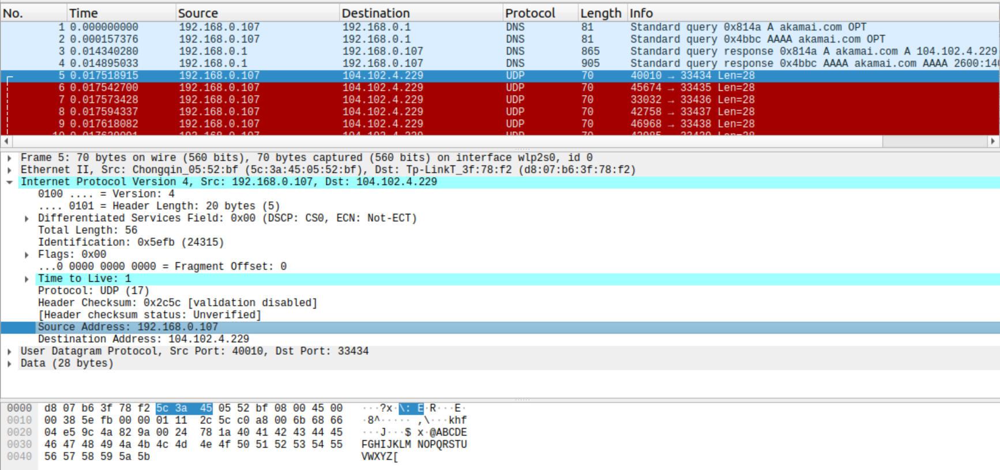 
2. Указан протокол `UDP` в поле протокола верхнего уровня
    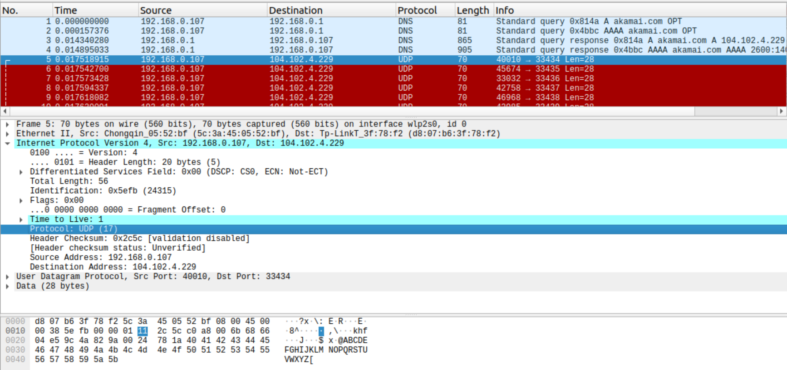 
3. В IP-заголовке 20 байт (`Header Length: 20 bytes`). На полезную нагрузку IP-дейтаграммы приходится 36 байт (`Total Length: 56` - суммарно 56 и заголовок, как уже знаем 20)
    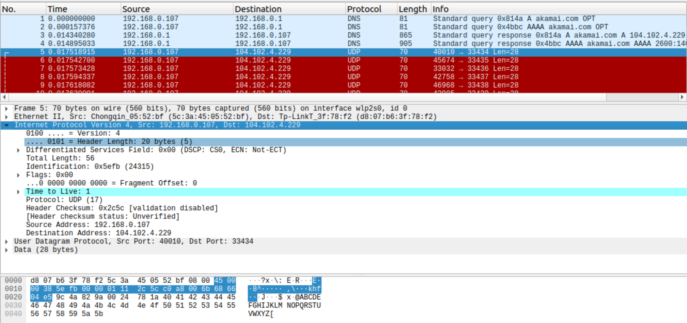 
4. * В рамках одной последовательности ICMP-сообщений всегда изменяются поля            `Identification`, `Header Checksum` и `Time to Live`
   * Не меняются `Version`, `Header Length`, `Differentiated Services Field`, `Total Length`, `Flags`, `Fragment Offset`, `Protocol`, `Source Address`, `Destination Address`. В рамках одного запуска утилиты поля `Version` (версия протокола IP4 или IP6), `Header Length`(длина заголовка), `Source Address` и `Destination Address` должны оставаться неизменными, все остальные: `Differentiated Services Field` (задает приоритетность пакета и вид критерия выбора маршрута), `Total Length` (общая длина), `Flags` (содержит признаки, связанные с фрагментацией), `Fragment Offset` (смещение используемое при сборке/разборке пакетов при фрагментации), скорее всего, можно менять при помощи флагов `traceroute`
   *  Значение поля Identification IP-дейтаграммы с каждым последующим эхо-запросом должно изменяться на единицу, как мне удалось выяснить, но в моем случае это не так (0x5efb, 0xf6ae, 0xb22d, 0x4ace - первые 4)
5. Вот содержимое этих полей: `Identification: 0xb59a (46490)` (оно не соответствует значению этого же поля пакета, на который идёт ответ), `Time to Live: 64` (скорее всего выставлено достаточно большое число, чтобы ответ успел придти)
    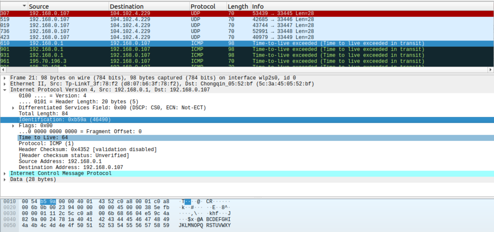 
6. Значение поля `Time to Live` не меняется(скорее всего зависит от маршрутизатора), `Identification` увеличивается на единицу с каждым новым пакетом, как видно (было 0xb59a и стало 0xb59b). Информация об истечении предписанного времени жизни содержится в полях ICMP-сообщения `Type: 11 (Time-to-live exceeded)` и `Code: 0 (Time to live exceeded in transit)` (тип и код, как было описано в предыдущем домашнем задании, описывают разновидность ICMP-пакета)
    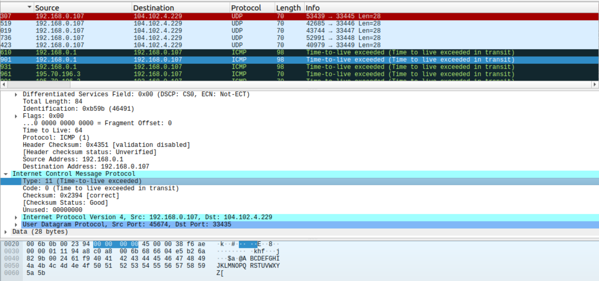 
7. Я предполагаю, что в вопросе ошибка и вместо `time-to-live exceeded` должно быть `Destination unreachable`, потому что иначе ответы на эти вопросы полностью лежат в предыдущем задании. Как видно, там лежит `Time to Live`, которые зависит от конечного хоста, и `Identification` увеличивается на единицу с каждым новым пакетом, чтобы поддерживать уникальность (он никак не зависит от этого же поля посланного нами пакета, вся информация содрежится внутри данных сообщения ICMP - там лежит заголовок IP запроса, сделанного нами)
    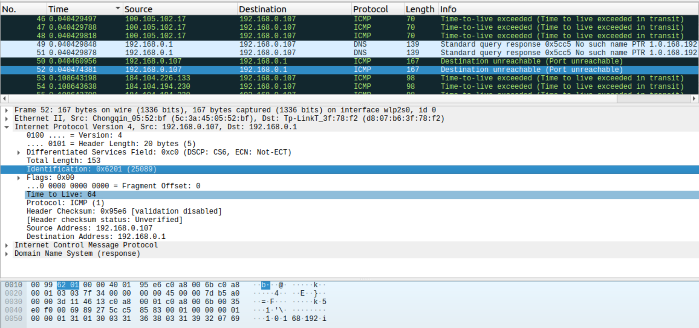 
    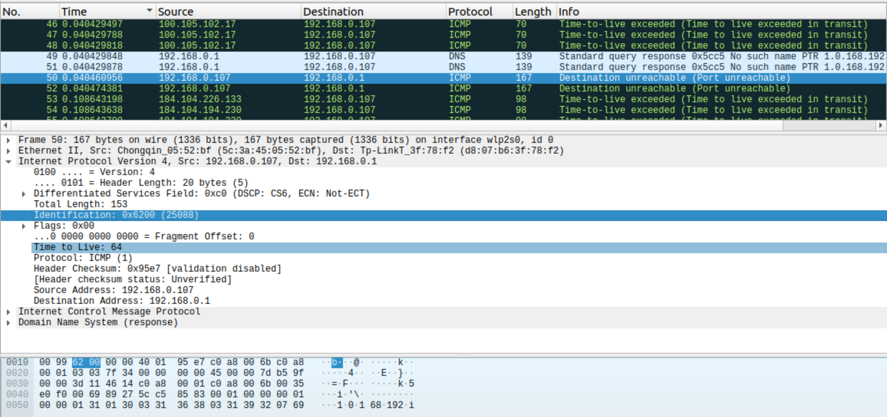 
8. ```
   feggie@feggie-NBLK-WAX9X:~$ traceroute -m 15 akamai.com 3500
    traceroute to akamai.com (104.72.72.205), 15 hops max, 3500 byte packets
    1  _gateway (192.168.0.1)  2.561 ms  2.497 ms  2.460 ms
    2  * * *
    3  vlan3.kronos.pu.ru (195.70.196.3)  6.232 ms  6.198 ms  6.160 ms
    4  spb-81-211-104-177.sovintel.ru (81.211.104.177)  6.124 ms  6.087 ms  6.051 ms
    5  MX01.Stockholm.gldn.net (79.104.229.53)  17.694 ms  17.658 ms  17.620 ms
    6  8-2-4-102.ear2.Stockholm2.Level3.net (62.140.24.21)  17.580 ms  14.555 ms  15.024 ms
    7  ae2.3204.edge7.Amsterdam1.level3.net (4.69.162.181)  70.034 ms  69.962 ms  69.925 ms
    8  212.72.47.190 (212.72.47.190)  69.860 ms  69.829 ms  69.799 ms
    9  ae2.r02.ams01.icn.netarch.akamai.com (23.210.55.40)  69.758 ms  59.334 ms  59.276 ms
    10  ae12.r01.lon01.icn.netarch.akamai.com (95.100.192.124)  59.257 ms  59.211 ms  55.393 ms
    11  ae1.r02.lon01.ien.netarch.akamai.com (23.210.48.37)  55.052 ms  203.521 ms  203.457 ms
    12  ae3.virtus-lon4.netarch.akamai.com (23.210.48.225)  203.411 ms  93.046 ms  93.002 ms
    13  * * *
    14  * * *
    15  * * *
   ```
   Я предполагаю, что имелся ввиду запрос, отправленный *моим* компьютером, а не тот, который отправлен *моему* компьютеру, потому как ответ не был фрагменитрован (это можно понять по значению поля `Flags`). Далее ответ будет дан, на вопрос описанный выше

   * Да, это сообщение было фрагментировано на 3 IP-дейтаграммы (они представлены ниже)
   * Меняются поля `Total Length`, `Flags` и `Fragment Offset`, которые задают признаки, связанные с фрагментацией, и смещение используемое при сборке/разборке пакетов при фрагментации. Как видно, для первых двух IP-дейтаграмм `Flags` даёт понять, что это ещё не самая последняя IP-дейтаграмма, в рамках этого сообщения, для последней - по умолчанию. `Fragment Offset` меняяется в соответствии с уже отправленными полезными данными (это отступ от начала, с которого мы сейчас будем отправлять подотрезок). `Total Length` изменяется просто потому, что у нас полезная нагрузка делится не на равные части между дейтаграммами. Важно заметить, что `Identification: 0x616f (24943)` у всех дейтаграмм одинаковый.
    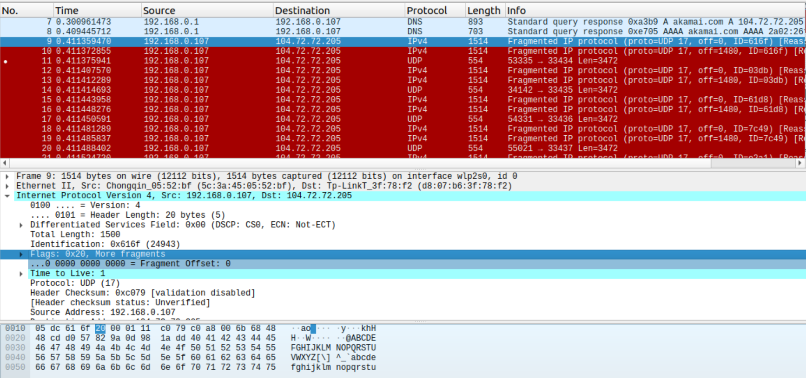 
    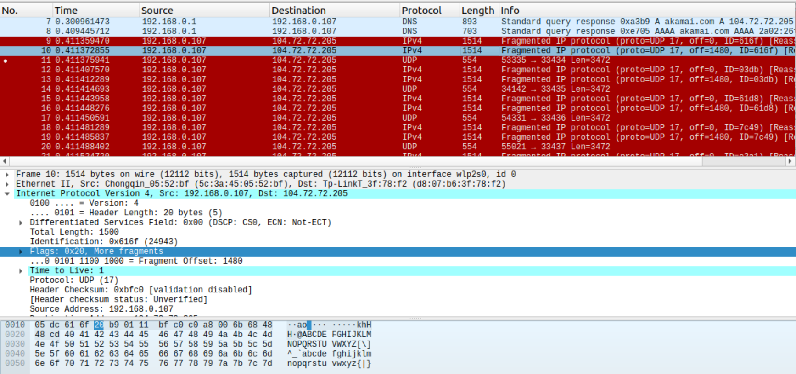 
    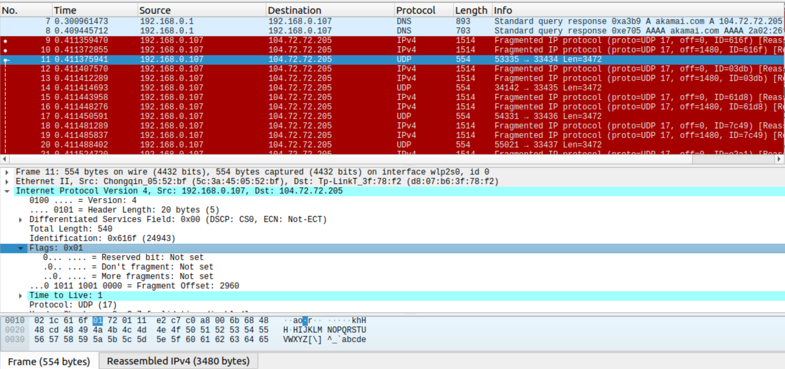 
    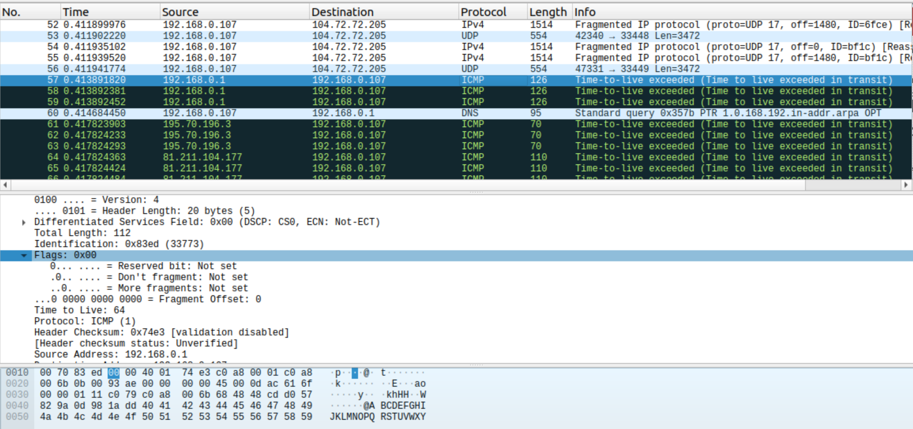 
