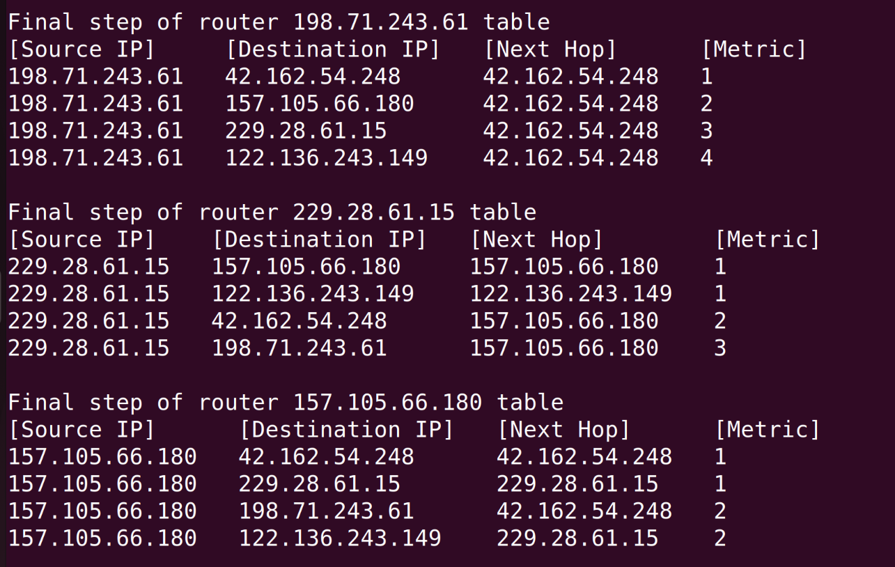

### Сборка
```
$ go build .
```
### Запуск 
`file` - имя конфигурационного файла
```
$ ./rip [-file=?.json]
```
### Пример работы
```
conf.json

[
    {
        "router": "198.71.243.61",
        "edges": [
            "42.162.54.248"
        ]
    },
    {
        "router": "42.162.54.248",
        "edges": [
            "198.71.243.61",
            "157.105.66.180"
        ]
    },
    {
        "router": "157.105.66.180",
        "edges": [
            "42.162.54.248",
            "229.28.61.15"
        ]
    },
    {
        "router": "229.28.61.15",
        "edges": [
            "157.105.66.180",
            "122.136.243.149"
        ]
    },
    {
        "router": "122.136.243.149",
        "edges": [
            "229.28.61.15"
        ]
    }
]
```
#### Часть вывода:
```
...
Simulation step 0 of router 229.28.61.15 table
[Source IP]    [Destination IP]   [Next Hop]        [Metric]
229.28.61.15   157.105.66.180     157.105.66.180    1
229.28.61.15   122.136.243.149    122.136.243.149   1

Simulation step 1 of router 157.105.66.180 table
[Source IP]      [Destination IP]   [Next Hop]      [Metric]
157.105.66.180   42.162.54.248      42.162.54.248   1
157.105.66.180   229.28.61.15       229.28.61.15    1
157.105.66.180   198.71.243.61      42.162.54.248   2

Simulation step 2 of router 157.105.66.180 table
[Source IP]      [Destination IP]   [Next Hop]      [Metric]
157.105.66.180   42.162.54.248      42.162.54.248   1
157.105.66.180   229.28.61.15       229.28.61.15    1
157.105.66.180   198.71.243.61      42.162.54.248   2
157.105.66.180   122.136.243.149    229.28.61.15    2

Simulation step 1 of router 42.162.54.248 table
[Source IP]     [Destination IP]   [Next Hop]       [Metric]
42.162.54.248   198.71.243.61      198.71.243.61    1
42.162.54.248   157.105.66.180     157.105.66.180   1
42.162.54.248   229.28.61.15       157.105.66.180   2
...
```
#### Часть финальных таблиц:
