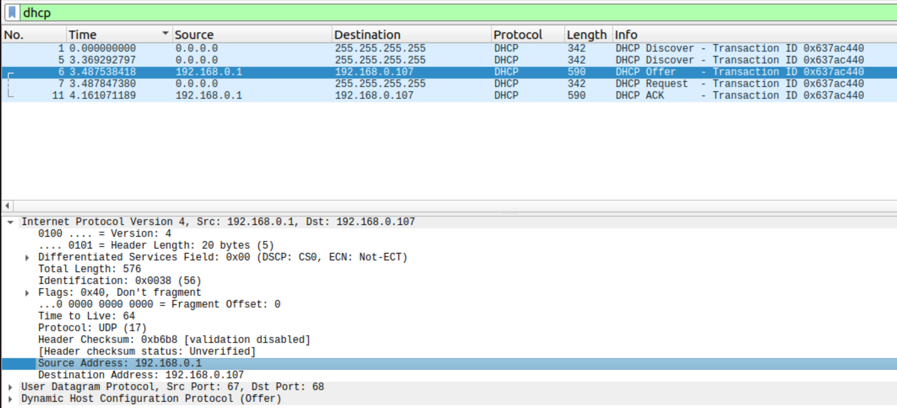

# Wireshark
## Wireshark: DHCP
1. Сообщения DHCP посылаются поверх протокола `UDP`
     
2. Адрес канального уровня у моего хоста - `Source: Chongqin_05:52:bf (5c:3a:45:05:52:bf)` (`5c:3a:45:05:52:bf`)
     
3. Значения Transaction-ID в наборе (Request/ACK) DHCP-сообщений одинаковые - `0x637ac440`. Этот идентификатор уникален для каждой незавершенной транзакции получения IP-адреса, поэтому позволяет отличать транзакцию от других, протекающих в то же время.
     
4. В моём случае с моей стороны всегда отправляются дейтаграммы с `Source Address` равным нулевой маске, и `Destiniton Address` равным единичной маске (отправка идёт широковещательно без IP-адреса отправителя). Сервер же всегда отвечает со своим адресом в качестве `Source Address`, и `Destiniton Address` равным тому, который он хочет мне выдать. Это произошло, потому что в пакете `Discover` был запрошен тот же `IP-адрес`, что у меня и был до этого. Возможна ситуация, когда сервер отсылал бы свои дейтаграммы шириковещательно или `Destination Address: 255.255.255.255`, в самом конце успешеного взаимодействия, в этом случае, со стороны хоста был бы отправлен пакет `Inform` с `Source Address` равным своему новому IP-адресу, и `Destiniton Address` равному адресу DHCP-сервера, на который должна прийти дейтаграмма от сервера также с настоящими адресами (адрес сервера и новый адрес хоста) с пакетом `ACK`
     
     
     
5. IP-адрес моего DHCP-сервера - `192.168.0.1`
     
6. После завершения нашей сессии использования выданного нам IP-адреса, мы не отсылаем никакого пакета, который бы сообщил DHCP-серверу, что нам больше не нужен этот адрес. Вместо этого используется срок аренды IP-адреса, который определяет время, через которое DHCP-сервер будет считать этот адрес свободным, а значит также время, через которое мы повторно запросим новый адрес для себя, если наша сессии в сети не закончена. Длительность срока аренды в моём случае `IP Address Lease Time: (7200s) 2 hours` (2 часа)
     
