## Получить список всех продуктов 
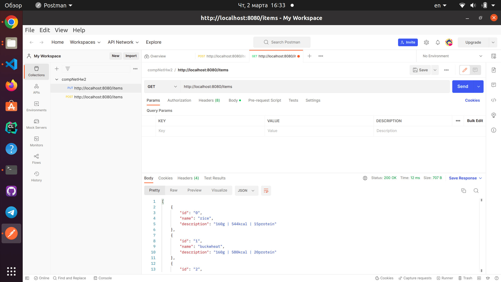

## Добавить новый продукт. При этом его id должен сгенерироваться автоматически 

Добавляем творог и видим, что сгенерировался id=5 (для наглядности ответ сделан, как в предыдущем запросе, чтобы не вызывать его много раз в этой лабе)

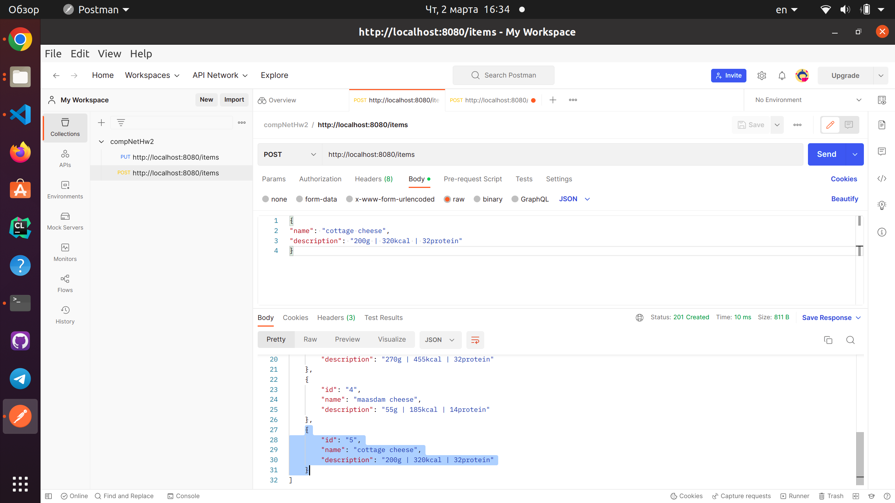

## Получить продукт по его id 
Запросил только что добавленный элемент
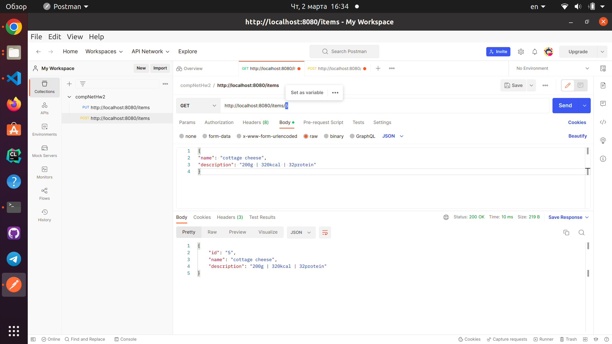

## Обновить существующий продукт (обновленные данные продукта передаются в теле запроса) 
Заменил описание у первого элемента (раньше была граммовка, калории и количество белка)
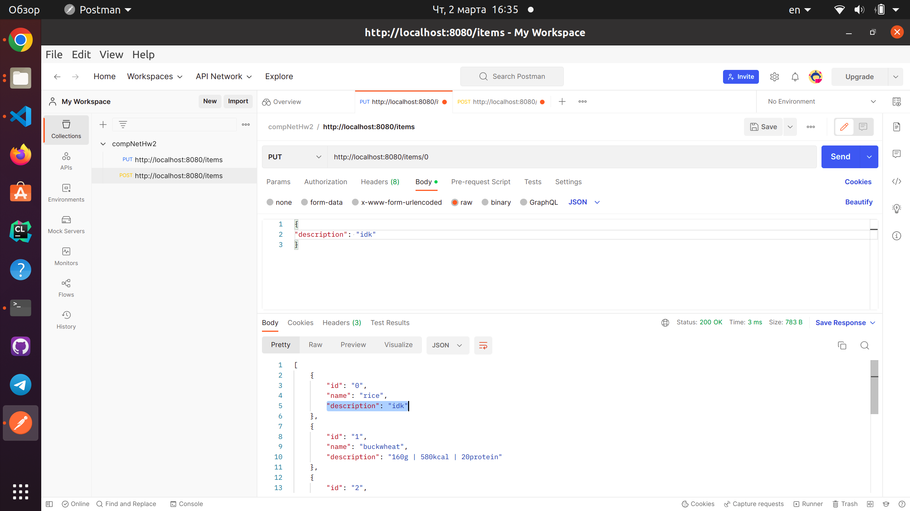

## Удалить продукт по его id 
Удаляем первый элемент с плохим описанием (видно, что теперь первый с id=1)
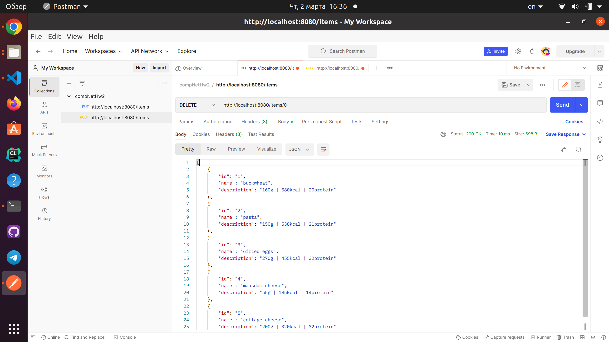

## Добавляем картинку к элементу
Указал id=1, и в качестве картинки снимок экрана ...
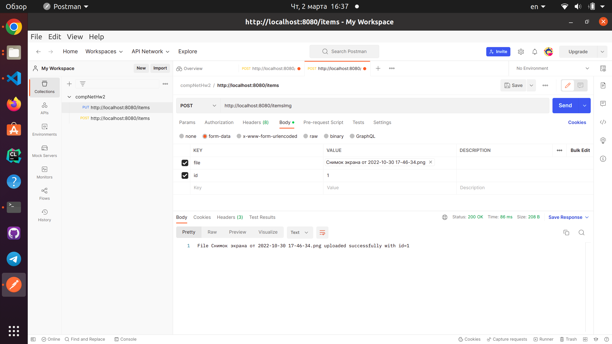

## Получение картинки товара по id
Смотрим на только что добавленную картинку к товару 1
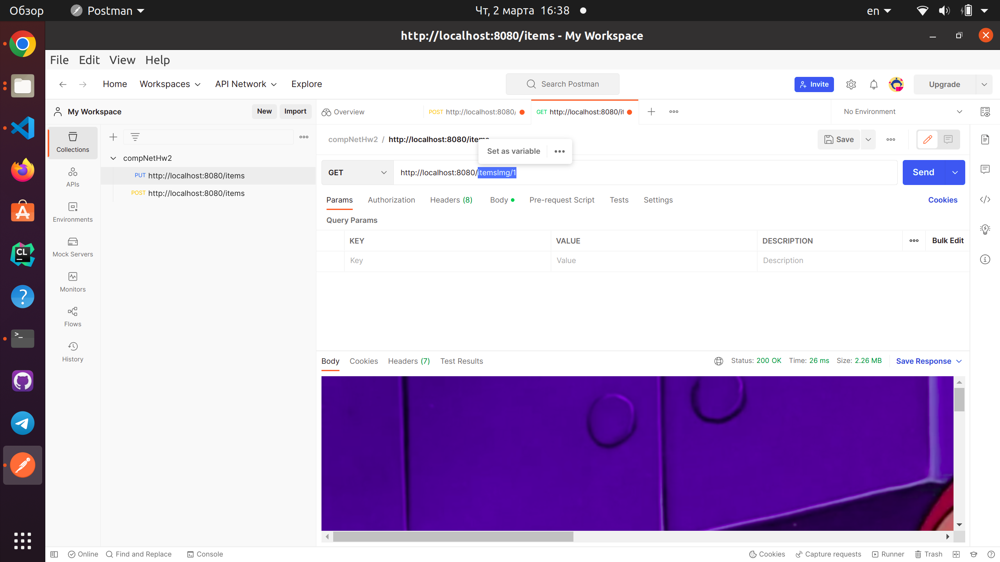
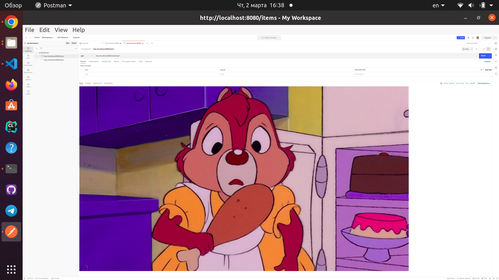

## Удаление картинки товара по id
Удалим картинку и убедимся, что её больше нет
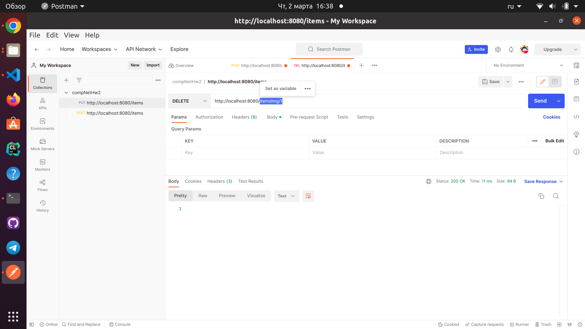
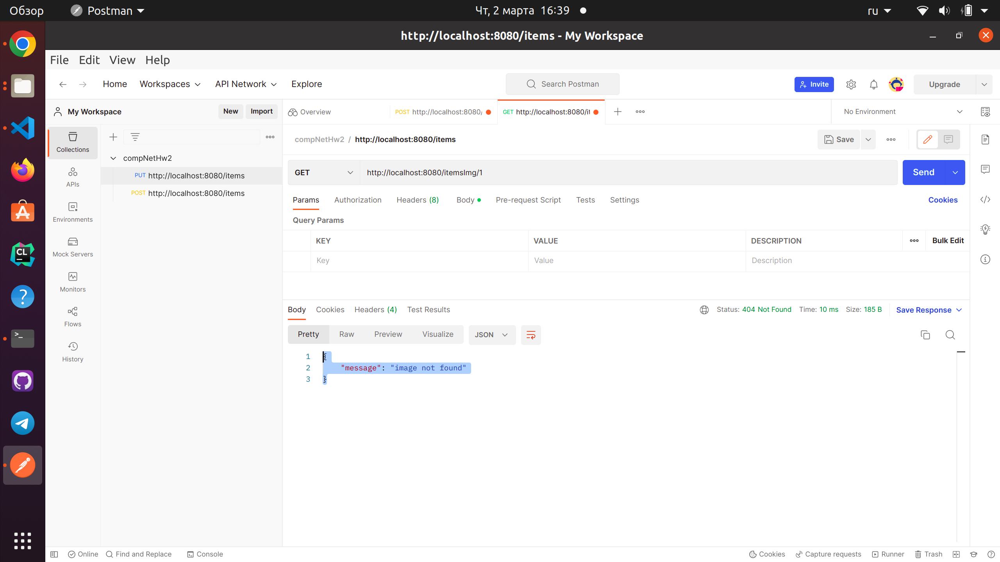

# Все запросы придедшие на сервер с кодами ошибок
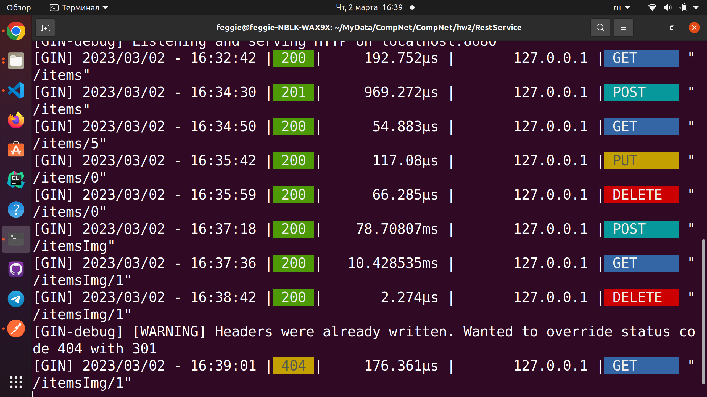