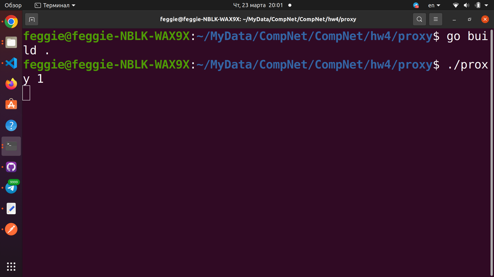
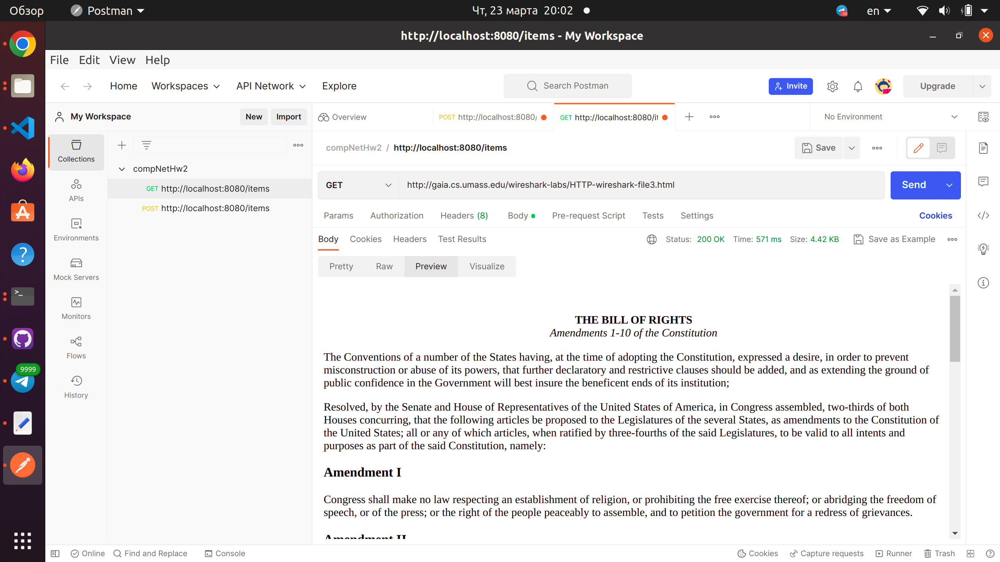
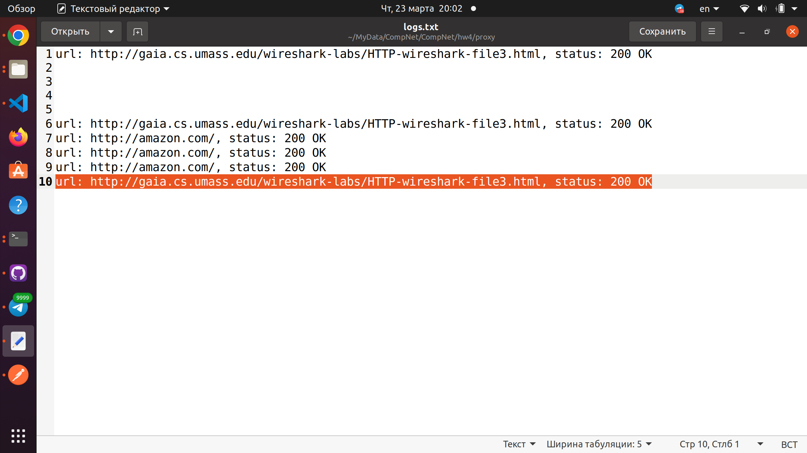
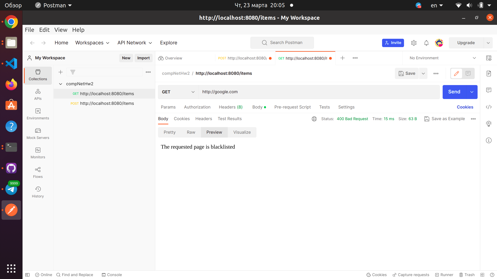

### Сборка
в директории `proxy`
```
$ go build .
```
### Запуск 
`n` - сколько одновременно подключений нужно поддержать(оставил с предыдущего дз)
```
$ ./proxy {n}
```
### Blacklist
В файле `blacklist.txt` можно указать по аналогии страницы, доступ к которым нужно ограничить - `proxy` отдаст `400 Bad Request` на такой запрос
### Logs
Логи хранятся в файле `logs.txt` (он автоматически создаётся)
### Cache
Пример того, в каком виде `proxy` хранит хешируемые файлы - файлы из 10 цифр в названии

### Пример работы
Запускаем `proxy`

Отсылаем запрос на получение `html` странички 

Повторяем его снова и видим, что время немного уменьшилось

Чтобы удостовериться, что запрос не был сделан снова смотрим в логи и видим, что в конце(первые 9 строк я забыл стереть после предыдущих запусков :), что запрос был сделан всего один
  
Попробуем обратиться к `google.com` из `blacklist`
  