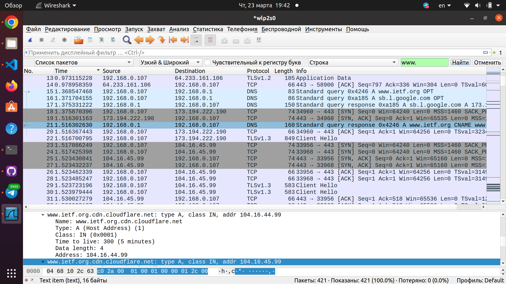
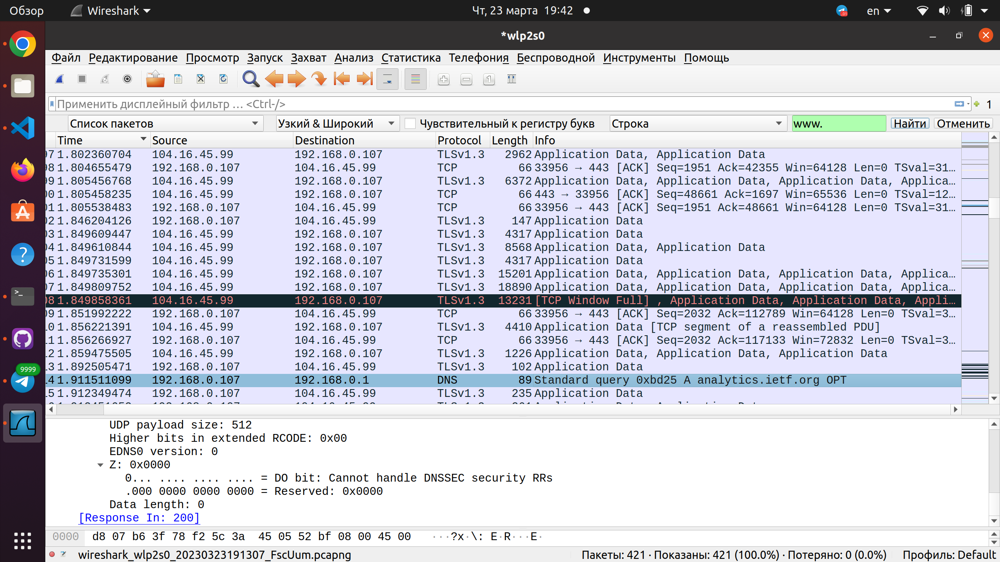

## A - Утилита nslookup 
## 1.
```
$ nslookup www.tsinghua.edu.cn
``` 
```
Server:		127.0.0.53
Address:	127.0.0.53#53

Non-authoritative answer:
Name:	www.tsinghua.edu.cn
Address: 166.111.4.100
Name:	www.tsinghua.edu.cn
Address: 2402:f000:1:404:166:111:4:100
```
Получается `166.111.4.100`

## 2.

```
$ nslookup -type=NS www.rca.ac.uk
```
```
Server:		127.0.0.53
Address:	127.0.0.53#53

Non-authoritative answer:
www.rca.ac.uk	canonical name = www.rca.ac.uk.cdn.cloudflare.net.

Authoritative answers can be found from:

```
Я так и не смог починить, чтобы хоть для какого-то сервера мне дало не пустоту - взял изи гугла, что там будет:
```
cloudflare.net
    origin = ns1.cloudflare.net
    mail addr = dns.cloudflare.net
    ...
    minumum = 3600
```
Отсюда уже видно, что нужный нам dns сервер - `ns1.cloudflare.net`

## 3.
Пример такого веб-сервера `google.com`
```
$ nslookup google.com
```
```
Server:		127.0.0.53
Address:	127.0.0.53#53

Non-authoritative answer:
Name:	google.com
Address: 108.177.14.113
Name:	google.com
Address: 108.177.14.100
....
```


```
$ nslookup spbu.ru
```
```
Server:		127.0.0.53
Address:	127.0.0.53#53

Non-authoritative answer:
Name:	spbu.ru
Address: 81.89.183.222
```
Один ip-адрес

## Б. DNS-трассировка www.ietf.org
1. С использованием протокола `DNS`
2. `User Datagram Protocol, Src Port: 47879, Dst Port: 53` отсюда видно, что нужный порт - 53
3. `192.168.0.107(sourse)	192.168.0.1(destination)	DNS(protocol)	83(length)	Standard query 0x4246 A www.ietf.org OPT (info)`. destination совпадает с моим локальным dns(192.168.0.1)
4. Запрашивается запись типа: `Type: A (Host Address) (1)`, в запросе не содержится ответов
5. Там 3 ответа (кратко): `www.ietf.org: type CNAME, class IN, cname www.ietf.org.cdn.cloudflare.net`, `www.ietf.org.cdn.cloudflare.net: type A, class IN, addr 104.16.44.99`, `www.ietf.org.cdn.cloudflare.net: type A, class IN, addr 104.16.45.99`. Двое из них содержат адреса `104.16.44.99` и `104.16.45.99`, и третий - псевдоним `www.ietf.org.cdn.cloudflare.net`
6. Соответствующая строка из wireshark: `1.517086249	192.168.0.107	104.16.45.99	TCP	74	33956 → 443 [SYN] Seq=0 Win=64240 Len=0 MSS=1460 SACK_PERM=1 TSval=31494494 TSecr=0 WS=128` (нашёл по второму ip-адресу из пункта 5)
7. 
 

Я выделил тёмно-синим на первом скриншоте dns-ответ, на втором dns-запрос. Мы видим, что, как только был получен ответ, начало отсылаться много запросов/приходить много ответов(в основном через TCP), и только потом произошел новый dns-запрос, отсюда мне кажется, что хост не выполняет новые запросы перед тем, как загрузить изображения

## В. DNS-трассировка www.spbu.ru

1. назначаения - 53, источника - 51237 `User Datagram Protocol, Src Port: 51237, Dst Port: 53`
2. На адрес `192.168.0.1`, да, совпадает
3. Запись типа : ```Type: AAAA (IPv6 Address) (28)```, ответы не содержатся в запросе
4. Один ответ:
```
Name: spbu.ru
Type: SOA (Start Of a zone of Authority) (6)
Class: IN (0x0001)
Time to live: 3600 (1 hour)
Data length: 41
Primary name server: ns.pu.ru
Responsible authority's mailbox: hostmaster.pu.ru
Serial Number: 2023032115
Refresh Interval: 7200 (2 hours)
Retry Interval: 3600 (1 hour)
Expire limit: 604800 (7 days)
Minimum TTL: 3600 (1 hour)
```

## Г. DNS-трассировка nslookup –type=NS

1. На адрес `192.168.0.1`, да, совпадает
2. Запись типа : `Type: NS (authoritative Name Server) (2)`, ответы не содержатся в запросе
3. 3 ответа:
```
Name: www.spbu.ru
Type: CNAME (Canonical NAME for an alias) (5)
Class: IN (0x0001)
Time to live: 3600 (1 hour)
Data length: 2
CNAME: spbu.ru
```

```
Name: spbu.ru
Type: NS (authoritative Name Server) (2)
Class: IN (0x0001)
Time to live: 3600 (1 hour)
Data length: 8
Name Server: ns.pu.ru
```

```
Name: spbu.ru
Type: NS (authoritative Name Server) (2)
Class: IN (0x0001)
Time to live: 3600 (1 hour)
Data length: 6
Name Server: ns2.pu.ru
```

Адресов, как видно, нет

## Д. DNS-трассировка nslookup www.spbu.ru ns2.pu.ru

1. На адрес `195.70.196.210`, теперь уже не совпадает. Он принадлежит хосту `ns2.pu.ru`
2. Запись типа : `Type: NS (authoritative Name Server) (2)`, ответы не содержатся в запросе
3. Один ответ:
```
Name: spbu.ru
Type: SOA (Start Of a zone of Authority) (6)
Class: IN (0x0001)
Time to live: 3600 (1 hour)
Data length: 41
Primary name server: ns.pu.ru
Responsible authority's mailbox: hostmaster.pu.ru
Serial Number: 2023032115
Refresh Interval: 7200 (2 hours)
Retry Interval: 3600 (1 hour)
Expire limit: 604800 (7 days)
Minimum TTL: 3600 (1 hour)
```

## Е. Сервисы whois
1. WHOIS – это база данных, в которой хранятся сведения о доменах
2. использовал `https://public-dns.info/` нашёл `73.6.19.226`(United States, Houston) и `80.108.123.17` (Austria, Vienna)
3. 
Мой локальный DNS:
```
$ nslookup 192.168.0.1
```

```
1.0.168.192.in-addr.arpa	name = _gateway.

Authoritative answers can be found from:

```
United States, Houston:
```
$ nslookup 73.6.19.226
```

```
226.19.6.73.in-addr.arpa	name = c-73-6-19-226.hsd1.tx.comcast.net.

Authoritative answers can be found from:

```
Austria, Vienna:
```
$ nslookup 80.108.123.17
```

```
17.123.108.80.in-addr.arpa	name = 80-108-123-17.cable.dynamic.surfer.at.

Authoritative answers can be found from:


```