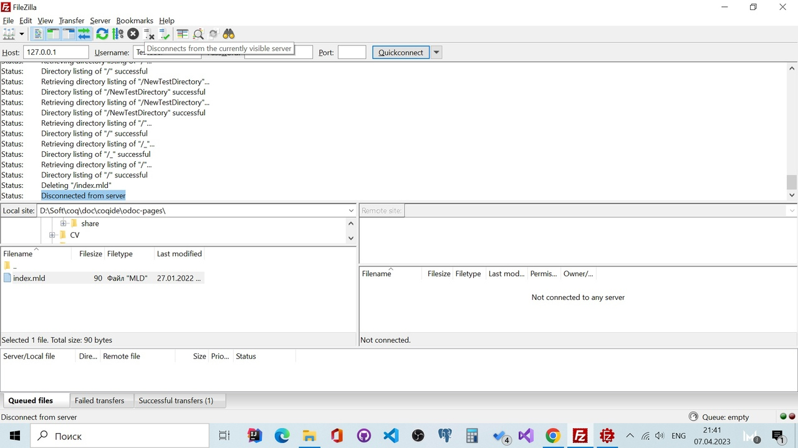

# FileZilla сервер и клиент
### Запускаем сервер и подключаемся с клиента 

Видим сообщение `Connecting to 127.0.0.1:27 ...` и последующие, дающие понять, что всё прошло успешно. 

### Далее пытаемся добавить файл в нашу папку.

Выполняем `Process Queue`, чтобы отправить файл

Видим, что запрос прошёл успешно, и файл отобразился в `Remote site`
### Пробуем создать папку

Видим, что папка `NewTestDirectory` создалась
### Пробуем удалить переданный файл и созданную папку

### Отключаемся от сервера
