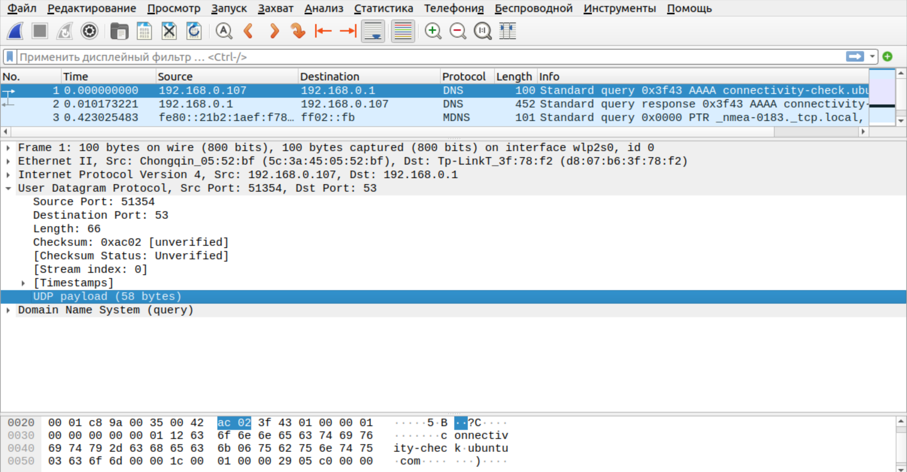
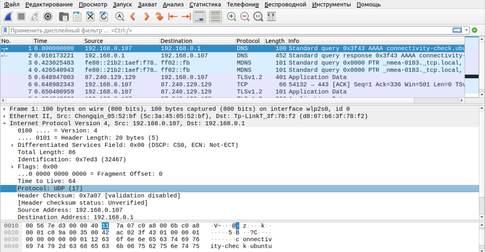
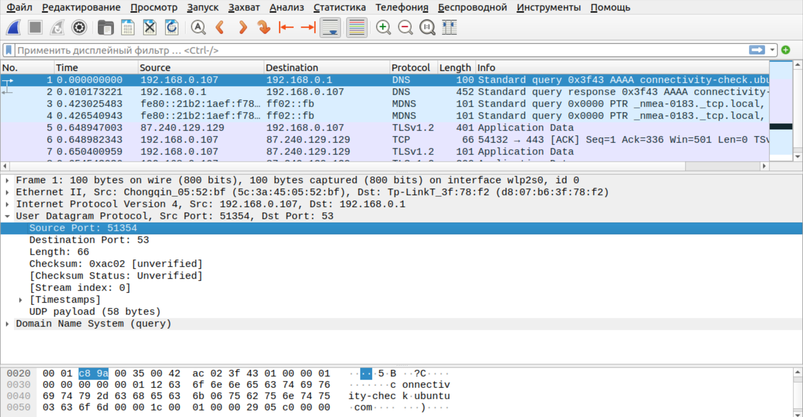

# Wireshark: UDP
### 1. Выберите один UDP-пакет. По этому пакету определите, сколько полей содержит UDP-заголовок. 
 
Видим 4 поля "Source port", "Destination Port", "Length", "Checksum"

### 2. Определите длину (в байтах) для каждого поля UDP-заголовка, обращаясь к отображаемой информации о содержимом полей в данном пакете. 
Каждое поле заголовка у нас по 2 байта. Всего их 4, значит на весь заголовок ушло 8 байт. Как видим в "Length" у нас указано, что 66 байт всего, значит на данные у нас выделено 58 байт, что мы и наблюдаем `UDP payload (58 bytes)`

### 3. Значение в поле Length (Длина) – это длина чего? 
Это длина UDP датаграммы, то есть UDP заголовка + данных, которые мы хотим передать

### 4. Какое максимальное количество байт может быть включено в полезную нагрузку UDP-пакета? 
Максимальный размер дейтаграммы UDP составляет 64 КБ за вычетом размера заголовка UDP (8 байт) и размера заголовка IP (20 байт для IPv4 или 40 байт для IPv6). ([sources](https://www.ibm.com/docs/ru/aix/7.2?topic=tuning-udp))

###  5. Чему равно максимально возможное значение номера порта отправителя?
`65535` (максимальное число длины не более 16 бит), так как под него выделено 2 байта

###  6. Какой номер протокола для протокола UDP? Дайте ответ и для шестнадцатеричной и десятеричной системы. Чтобы ответить на этот вопрос, вам необходимо заглянуть в поле Протокол в IP-дейтаграмме, содержащей UDP-сегмент.
 
17 (0x11)

###  7. Проверьте UDP-пакет и ответный UDP-пакет, отправляемый вашим хостом. Определите отношение между номерами портов в двух пакетах.
 
 
"Source Port" теперь старый "Destination Port", и наоборот (поменялись местами, потому что ответ отправляется теперь с порта, на который мы отправляли запрос)