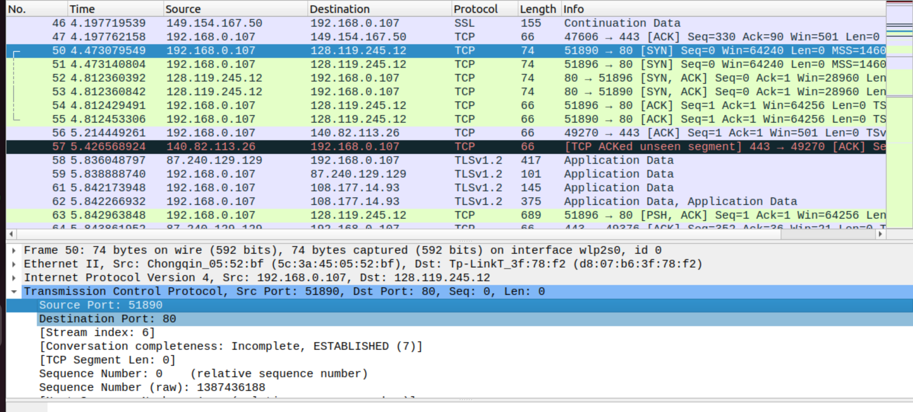
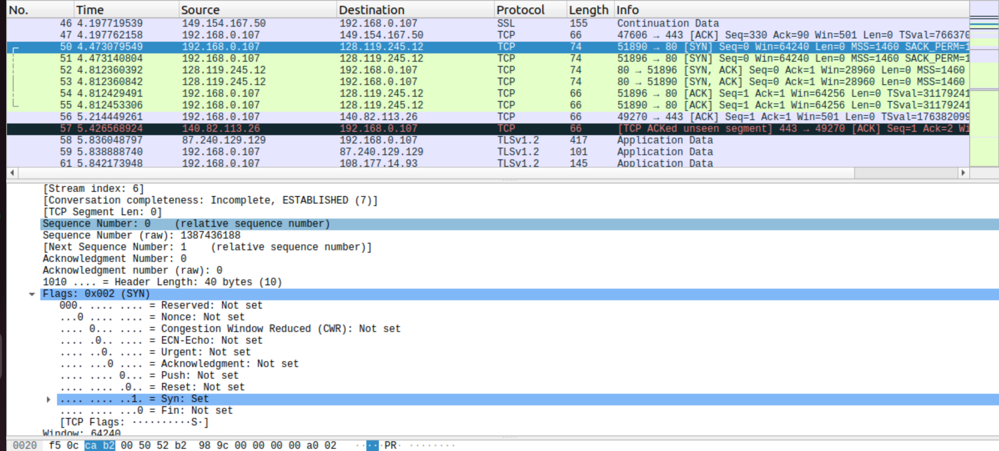
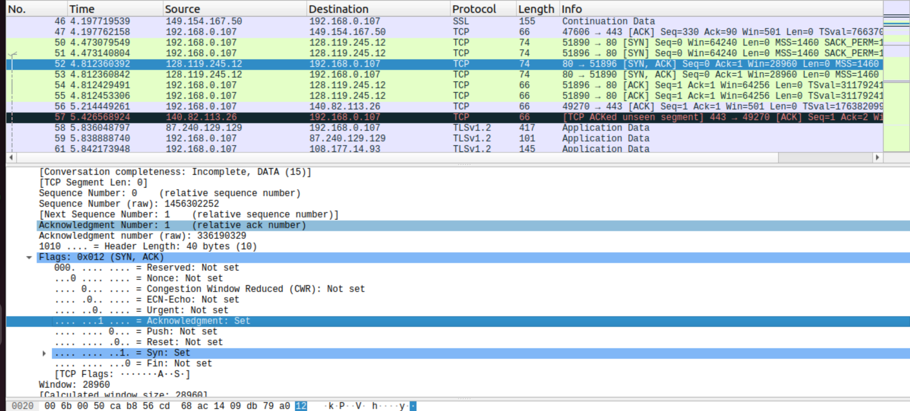
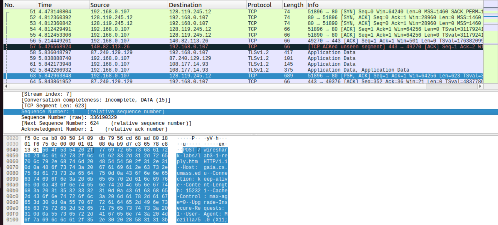
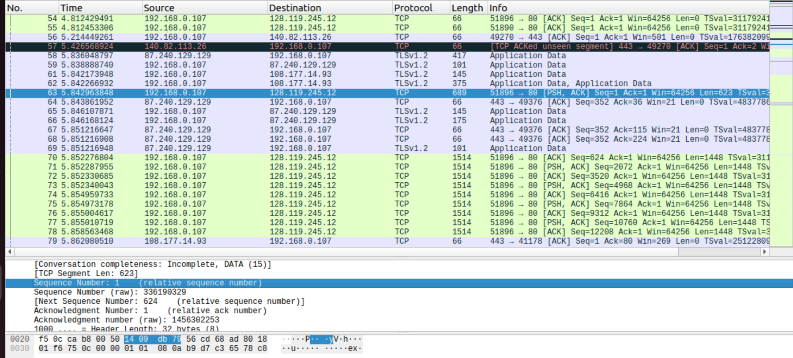
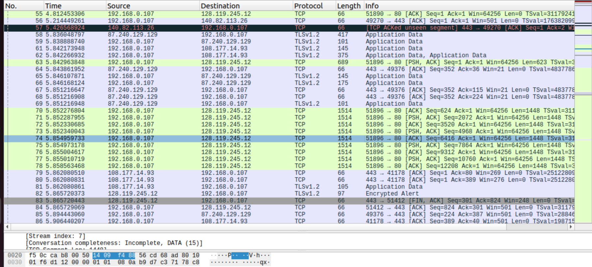
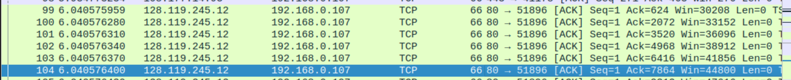
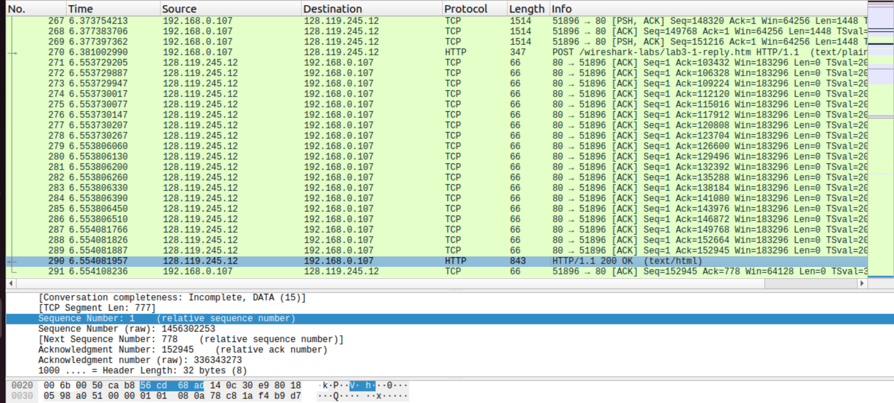
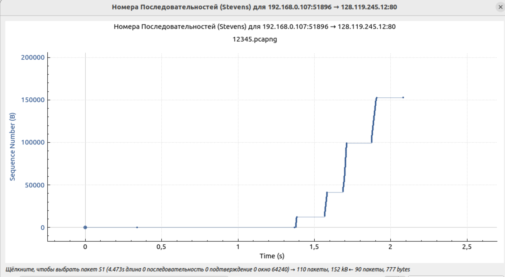

# Wireshark
## Работа с TCP
1. Мой компьютер использует IP-адрес - `192.168.0.107`, порт - `51890`

2. IP-адрес сервера gaia.cs.umass.edu - `128.119.245.12`. Порт отправки - `51890`, порт приёма - `80` - для пакетов, которые отправляются от моего компьютера к серверу (и наоборот, если иначе)
3. SYN-сегмент определяется по флагу `SYN`, как видно на картинке. У SYN TCP-сегмента порядковый номер (`Sequence number`) равен 0

4. У SYNACK TCP-сегмента порядковый номер (`Sequence number`) равен 0, в поле подтверждения SYNACK-сегмента (`Acknowledgement number`) хранится 1, сервер получил это значение, прибавив единицу к порядковому номеру `SYN` пакета, который прислал мой компьютер. SYNACK-сегмент можно отличить по двум выставленным флагам `SYN` и `Acknowledgement`

5. Порядковый номер (`Sequence number`) у TCP-сегмента, содержащего команду POST протокола HTTP, равняется 1

6. 1) `Sequence number=1`   , `timeSending=5.84296`, `timeReceiving=6.04057`, `RTT=0.19761`(разница двух времён)
   2) `Sequence number=624` , `timeSending=5.85227`, `timeReceiving=6.04057`, `RTT=0.18830`
   3) `Sequence number=2072`, `timeSending=5.85228`, `timeReceiving=6.04057`, `RTT=0.18829`
   4) `Sequence number=3520`, `timeSending=5.85233`, `timeReceiving=6.04057`, `RTT=0.18824`
   5) `Sequence number=4968`, `timeSending=5.85234`, `timeReceiving=6.04057`, `RTT=0.18823`
   6) `Sequence number=6416`, `timeSending=5.85495`, `timeReceiving=6.04057`, `RTT=0.18562`
    
    
    
7. Размер файла 152138байт, время отправки первого пакета, содержащего данные - 5.84296, время получения последнего `ACK` - 6.55408. Отсюда получаем 152138/(6.55408-5.84296)=213937.17 байт/с или примерно 209Кбайт/c

## Работа с Time-Sequence-Graph (Stevens) 
