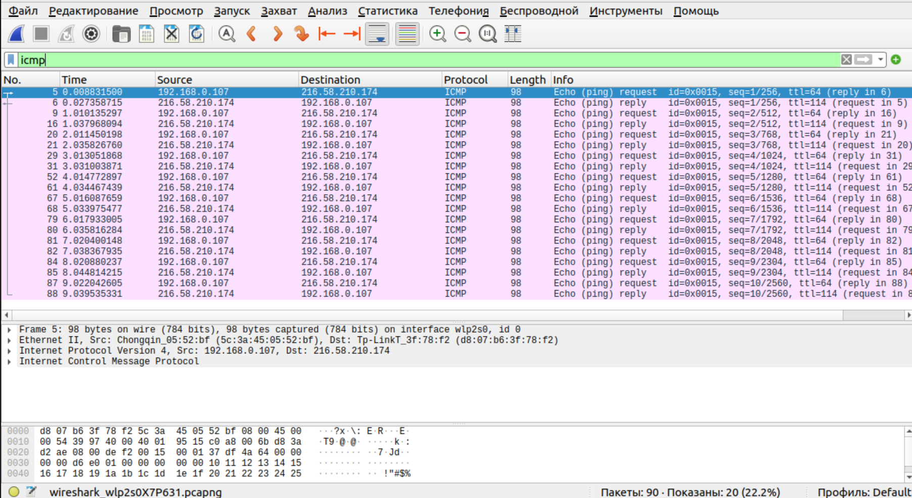
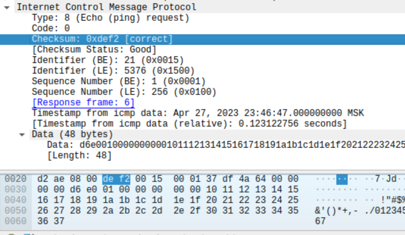
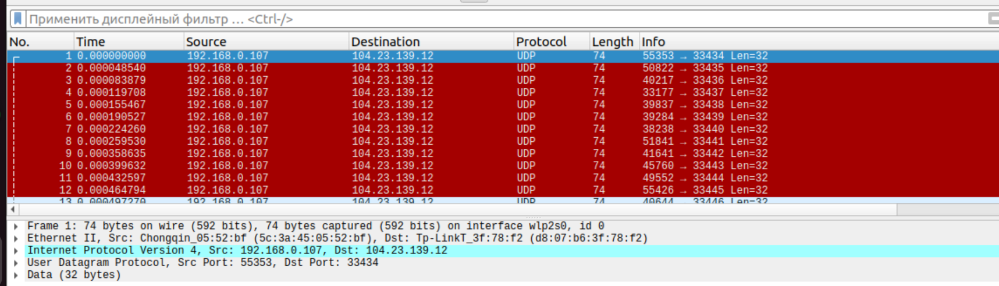
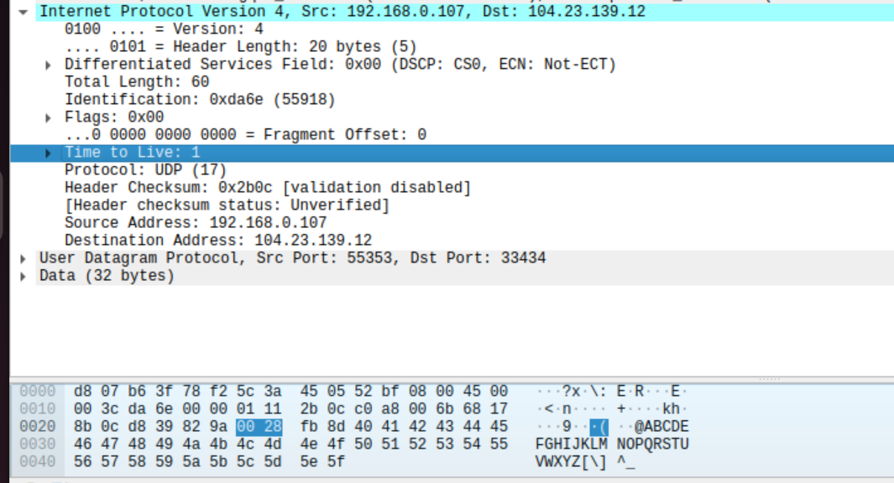
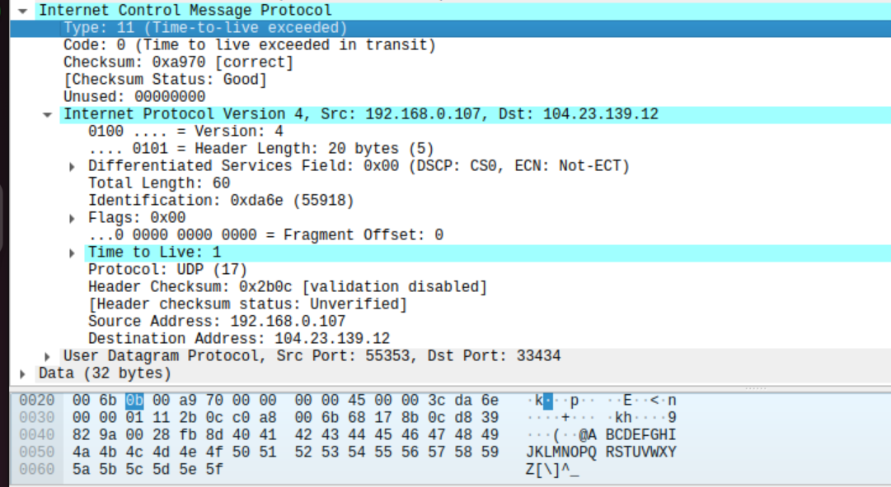
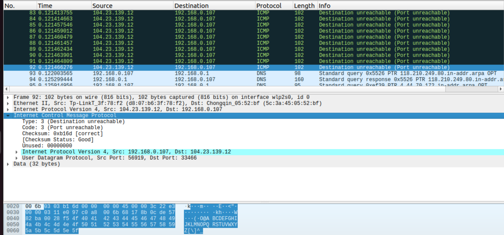
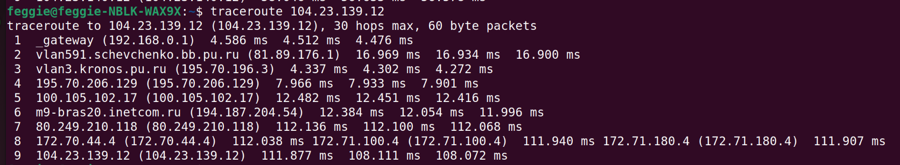

# Wireshark
## Wireshark: ICMP
1. IP-адрес моего хоста - `192.168.0.107`. IP-адрес хоста назначения - `216.58.210.174`  

2.  ICMP-пакет не обладает номерами исходного и конечного портов, потому что это сетевой протокол, который связывает хосты, а не процессы
3. `Type: 0 (Echo (ping) reply)` -  ICMP-тип 8 и `Code: 0` - кодовый номер пакета 0, говорят о том, что это эхо-запрос. Там присутствуют поля контрольной суммы, порядкового номера и идентификатора - все они занимают по 2 байта.  
4. `Type: 8 (Echo (ping) request)` -  ICMP-тип 8, `Code: 0` - кодовый номер пакета 0, как видим, не поменялись. Далее идут поля контрольной суммы, порядкового номера и идентификатора, которые, как в запросе, занимают по 2 байта. Как видим, `Checksum` поменялась, что логично, потому она кодирует заголовок (он у нас поменялся). `Identifier` и `Sequence Number` не поменялись, потому что они выставляются отправителем, и возвращаются обратно получателем. Именно таким образом отправитель идентифицирует отклик на свой запрос.
     

## Traceroute
traceroute to 104.23.139.12 (104.23.139.12), 30 hops max, 60 byte packets
 1)  _gateway (192.168.0.1)  4.586 ms  4.512 ms  4.476 ms
 2)  vlan591.schevchenko.bb.pu.ru (81.89.176.1)  16.969 ms  16.934 ms  16.900 ms
 3)  vlan3.kronos.pu.ru (195.70.196.3)  4.337 ms  4.302 ms  4.272 ms
 4)  195.70.206.129 (195.70.206.129)  7.966 ms  7.933 ms  7.901 ms
 5)  100.105.102.17 (100.105.102.17)  12.482 ms  12.451 ms  12.416 ms
 6)  m9-bras20.inetcom.ru (194.187.204.54)  12.384 ms  12.054 ms  11.996 ms
 7)  80.249.210.118 (80.249.210.118)  112.136 ms  112.100 ms  112.068 ms
 8)  172.70.44.4 (172.70.44.4)  112.038 ms 172.71.100.4 (172.71.100.4)  111.940 ms 172.71.180.4 (172.71.180.4)  111.907 ms
 9)  104.23.139.12 (104.23.139.12)  111.877 ms  108.111 ms  108.072 ms

1.  Запросы, посылаемые моим компьютером, отличаются от ICMP-пакетов с ping-запросами из Задания 1 (Ping). ICMP сообщение как таковое вообще в моём случае не завёрнуто под IP, как видимо предполагается в этом задании. `Source Address: 192.168.0.107` и `Destination Address: 104.23.139.12` дают понять, что это те самые пакеты, которые начинаются отправляться после запуска `traceroute 104.23.139.12`. Единственное поле, которое у нас есть, `Time to Live: 1` даёт нам понять, что это пакет, ответ на который будет возвращён нам первым маршрутизатором на пути (для других пакетов по аналогии)
     
     
2.  ICMP-пакет с сообщением об ошибке на запрос с предыдущего пункта, как видно содержит IP-заголовок нашего запроса (то, что это именно он, можно убедиться по `Identification: 0xda6e (55918)`, на скриншоте выше можно увидеть такой же идентификатор). Поля `Type: 11 (Time-to-live exceeded)` и `Code: 0 (Time to live exceeded in transit)` ICMP-сообщения говорят нам о его типе и более подробной информации - нам говорят о том, что мы превысили лимит по количеству маршрутизаторов на пути, как мы и хотели
     
3.  Последние ICMP-пакеты отличаются от ICMP-пакетов, сообщающих об ошибках, своим типом ICMP-пакета: `Type: 3 (Destination unreachable)` говорит в целом, что `Адресат недоступен`, и `Code: 3 (Port unreachable)` сообщает более подробную причину ошибки `Порт недостижим`. Это произошло, так как `traceroute` отправил пакет с достаточно большим `Time to Live`, поэтому конечный хост уже не может ответить нам привычным ICMP-пакетом с типом 11 или `Time-to-live exceeded`, так как `TTL` не исчерпан. `traceroute` задал удачный порт адресата для нас самостоятельно(его никто не слушал), поэтому нам и вернулся ICMP-пакет с такой ошибкой
     
4.  1. 194.187.204.54
        * CityMoscow: (90% confidence)
        * Subdivision: Moscow (MOW) (90% confidence)
        * Country: Russia (RU) (90% confidence)
        * Postalcode: 127220 (1% confidence)
        * Continent: Europe (EU)
        * Time zone: Europe/Moscow
    2. 80.249.210.118 
        * City Schiphol: (50% confidence)
        * Subdivision North: Holland (NH) (80% confidence)
        * Country Netherlands: (NL) (99% confidence)
        * Postalcode: 1119 (20% confidence)
        * Continent: Europe (EU)
        * Time zone: Europe/Amsterdam
    3. 172.70.44.4
        * Latitude 52.375900
        * Longitude 4.897500
        * Если посмотреть на карте - Netherlands
    4. 104.23.139.12
        * Country: United States (US) (99% confidence)
        * Continent: North America (NA)
        * Time zone: America/Chicago

     
